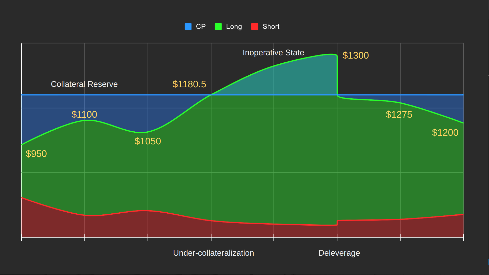

# Deleverage

When the pool is under-collateralized, there are three choices for a Derivative pool to go:

* (A) keep running and letting a bank run ensures, whoever withdraws first gets their fund back until the pool is empty, whoever hasn't withdrawn loses everything.
* (B) stop working and split the C reserve with the D holders pro-rata, CPs lose everything. Users will need to move their funds to other new pools to gain Derivative exposure again.
* (C) deleverage the Derivatives and keep the pool running.

(A) can be used if there’s a certainty that the pool will NEVER be under-collateralized, either via some centralized multi-organization contracts, or some insurance funds can cover the risk.

(B) is a simple and fair solution, but not the most optimal for user experience.

(C) is a technical improvement solution of (B), and is used by Power Perpetual.

<figure><figcaption></figcaption></figure>

Deleveraging allows users to keep holding their Derivative tokens without the risk of bank runs, or the cost of moving funds from pool to pool. In the event of Deleverage, the pool state will be rolled back to the market state where the Derivative token's capitalization crosses the collateral reserve.

<figure><figcaption>
Deleverage
</figcaption></figure>
